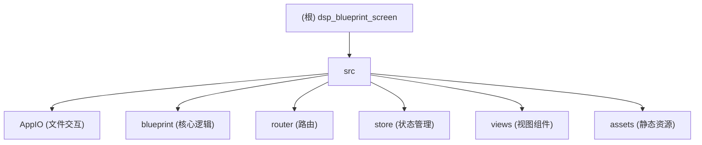

# CLAUDE.md

### 变更记录 (Changelog)

- **2025-09-01 17:19:57**: 手动执行深度项目扫描，扩充了模块索引，并开始为核心模块创建详细的 `CLAUDE.md` 文档。
- **2025-09-01 16:19:50**: 执行了初始化架构扫描。生成了项目总览、模块结构图，并识别出核心目录与技术栈。当前扫描覆盖率较低，核心业务逻辑待深入分析。

---

This file provides guidance to Claude Code (claude.ai/code) when working with code in this repository.

## 项目愿景 (Project Overview)

This is a local blueprint screening and management tool for the game "Dyson Sphere Program", built with Vue 3 and Electron.

## 架构总览 (High-Level Architecture)

- **Frameworks**: The application uses Vue 3 for the frontend and Electron for the desktop wrapper.
- **Main Process**: The Electron main process is managed by `src/background.ts`, which handles window creation and application lifecycle events.
- **Renderer Process**: The frontend is a standard Vue application with its entry point at `src/main.ts`. It uses Vue Router for navigation and Vuex for state management.
- **File System Interaction**: All interactions with the local file system, such as reading blueprint files and handling configurations, are abstracted in the `src/AppIO/` directory.
- **Blueprint Logic**: The core logic for parsing and managing blueprints is located in the `src/blueprint/` directory.
- **Configuration**: Application paths are configured via a `config.json` file, which is managed through a settings dialog within the app.

### 模块结构图 (Module Structure)



### 模块索引 (Module Index)

| 模块路径 | 主要语言 | 职责描述 | 关键文件/入口 |
| :--- | :--- | :--- | :--- |
| `src/` | TypeScript | 应用源代码根目录 | `background.ts`, `main.ts` |
| `src/AppConfig/`| TypeScript | 应用配置管理 | `config.ts` |
| [`src/AppIO/`](./src/AppIO/CLAUDE.md) | TypeScript | 文件系统交互抽象 | `ConfigManager.ts`, `Read.ts`, `Write.ts` |
| [`src/blueprint/`](./src/blueprint/CLAUDE.md)| TypeScript | 蓝图解析与管理核心逻辑 | `parser.ts`, `replace.ts` |
| `src/components/`| Vue/TS | 全局可复用UI组件 | `HelloWorld.vue` |
| `src/data/` | TypeScript | 游戏静态数据 (物品, 配方) | `items.ts`, `recipes.ts`, `icons.ts`|
| `src/DataType/` | TypeScript | 全局数据类型定义 | `BaseData.ts`, `tiemData.ts` |
| [`src/router/`](./src/router/CLAUDE.md) | TypeScript | 前端路由配置 | `index.ts` |
| [`src/store/`](./src/store/CLAUDE.md) | TypeScript | Vuex 状态管理 (骨架) | `index.ts` |
| [`src/views/`](./src/views/CLAUDE.md) | Vue/TS | 页面级视图组件 | `HomeView.vue`, `Settings.vue` |
| `src/assets/` | - | 静态资源 (图片, 样式) | - |

## 运行与开发 (Running and Development)

- **Install Dependencies**:
  ```bash
  yarn install
  ```

- **Run in Development Mode**:
  ```bash
  yarn electron:serve
  ```

- **Build for Production**:
  ```bash
  yarn electron:build
  ```

## 测试策略 (Testing Strategy)

在本次扫描中，未发现专门的测试目录（如 `tests/`, `__tests__/`）或测试文件（如 `*.spec.ts`）。建议为核心的蓝图处理逻辑 (`src/blueprint/`) 和文件 I/O (`src/AppIO/`) 添加单元测试和集成测试，以确保应用的稳定性和正确性。

## 编码规范 (Coding Standards)

项目基于 Vue CLI 创建，遵循标准的 Vue 和 TypeScript 编码规范。`package.json` 中包含了相关 linting 插件（`@vue/cli-plugin-typescript`），建议在开发流程中集成 `eslint` 检查以保持代码风格一致。

## AI 使用指引 (AI Usage Guide)

当使用 AI 辅助开发时，请遵循以下指引：
1.  **优先理解上下文**: 在修改代码前，请先阅读相关的 `CLAUDE.md` 文件和业务逻辑。
2.  **聚焦核心逻辑**: AI 应优先用于辅助实现 `src/blueprint/` 和 `src/AppIO/` 中的复杂算法和数据处理。
3.  **遵守规范**: 确保 AI 生成的代码符合项目现有的编码规范和测试标准。
4.  **增量更新文档**: 在完成一个功能或修复后，请更新相关的 `CLAUDE.md` 文档和 `.claude/index.json`。
